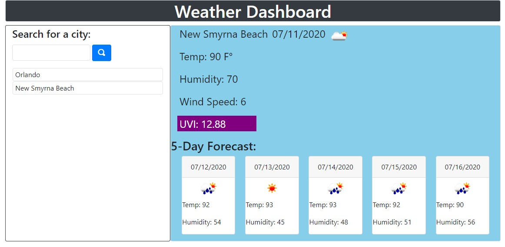

# Weather Dashboard

## Description
Searchs for weather in a city using the open weather API and shows the current conditions and a 5 day forecast for the location.

## Features
- Keeps track of the cities previously searched
- Shows the last 10 cities searched on page refresh

## Future Updates
- Unit toggle between Farenheit and Celcius
- Optional toggle for States to find cities with duplicate names (ie Miami FL and Miami OK)
- Allow for clicking on a 5 day card to show a more detailed look at the day.
